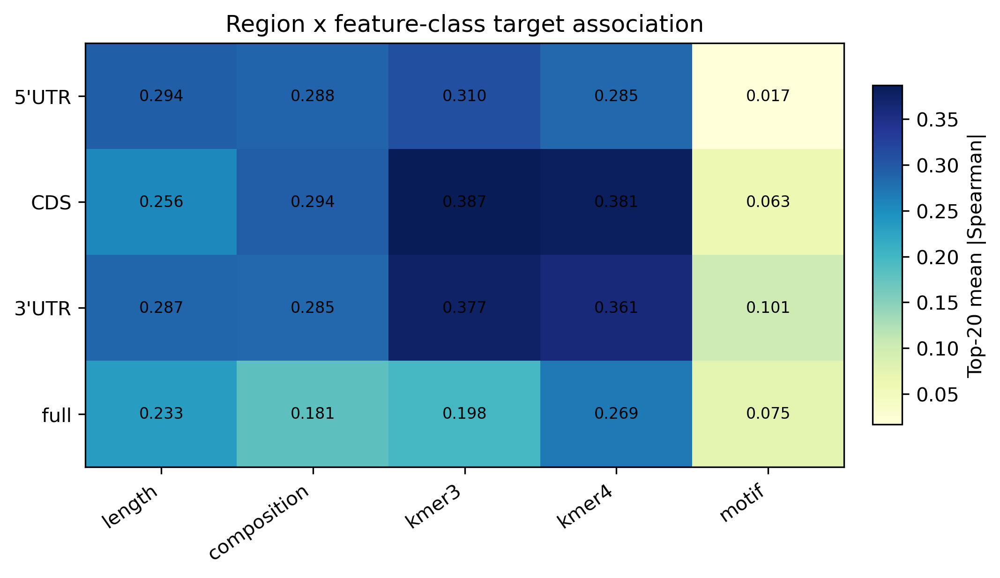
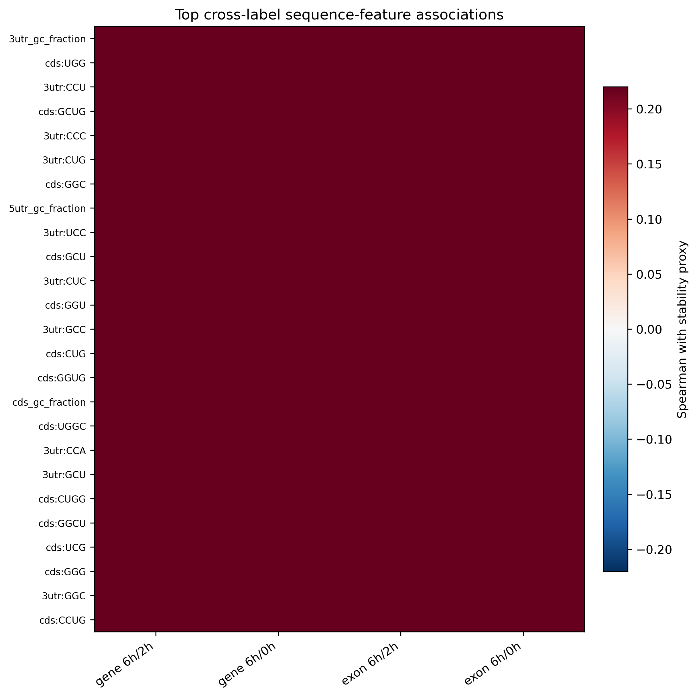
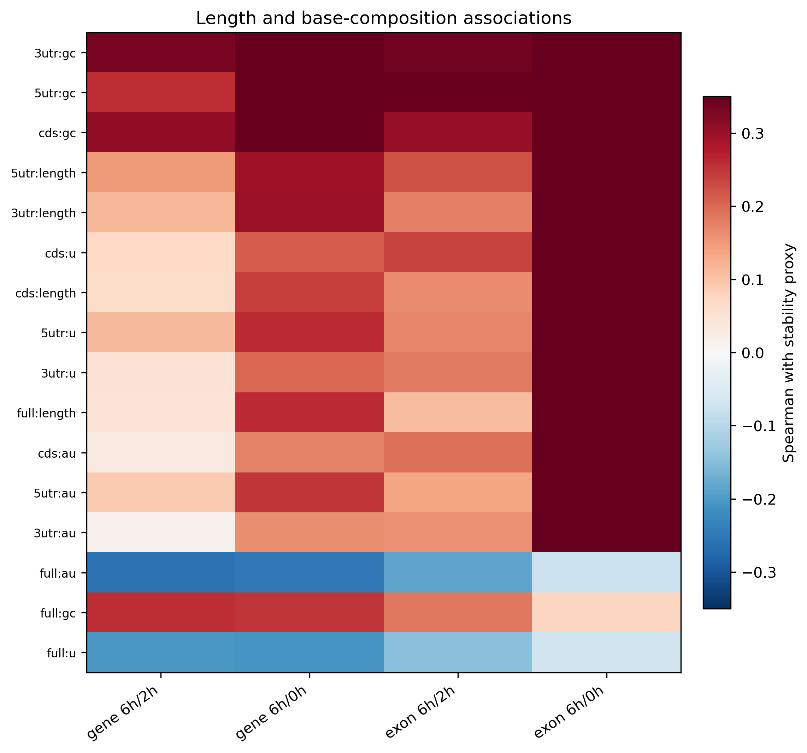
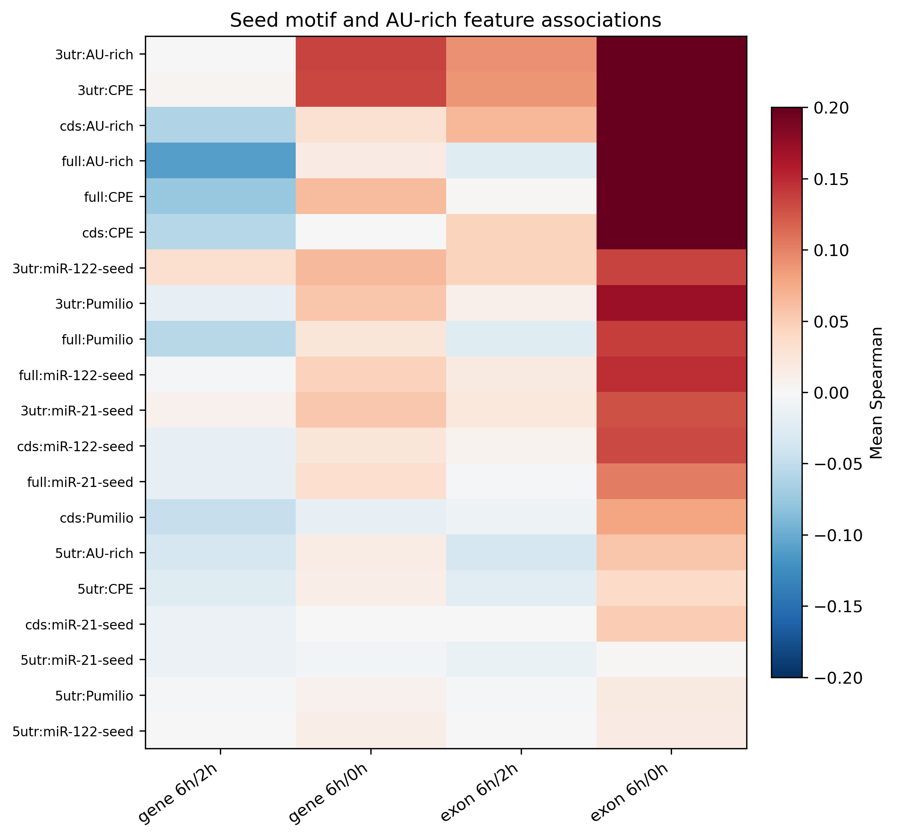

# Biological Interpretation of Sequence Signals

This report summarizes interpretable evidence from engineered-feature correlations, ElasticNet coefficients, XGBoost input ablations, and deep raw-sequence region ablations.

## Main Biological Readout

- In univariate feature-target associations, the strongest regional signal is `3utr`, followed by `cds`. This mostly reflects GC-rich and C/G-rich k-mer features, so it should be read as an association map, not as a causal region ranking.
- Predictive ablations give the stronger region-level evidence: removing CDS is the most damaging deep-sequence perturbation (-0.053 mean paired Pearson), and `structured_no_cds` is the most damaging engineered-feature leave-one-region-out condition (-0.104).
- The strongest interpretable feature class by association is `kmer4`. The signal is therefore better described as distributed sequence grammar than as one small hand-picked motif panel.
- `cds_only` remains close to the full engineered-feature model (-0.043 mean paired Pearson versus all regions), which supports CDS as the main compact sequence-information carrier.
- The strongest simple length/composition association is `5utr_gc_fraction` in `exon 6h/0h` (Spearman +0.587), which is especially important when interpreting the highly predictable exon-sense 6h/0h label.
- The strongest current motif-panel association is `3utr:AU-rich` in `exon 6h/0h` (mean Spearman +0.420). Motif-only ablation remains weak, so these motif hits should be treated as hypotheses rather than final mechanisms.

## Candidate Cross-Label Features

| Rank | Feature | Region | Class | Direction | Mean abs Spearman | Sign concordance |
| ---: | --- | --- | --- | --- | ---: | ---: |
| 1 | `3utr_gc_fraction` | `3utr` | `composition` | positive | 0.412 | 1.00 |
| 2 | `cds_kmer_UGG` | `cds` | `kmer3` | positive | 0.405 | 1.00 |
| 3 | `3utr_kmer_CCU` | `3utr` | `kmer3` | positive | 0.404 | 1.00 |
| 4 | `cds_kmer_GCUG` | `cds` | `kmer4` | positive | 0.403 | 1.00 |
| 5 | `3utr_kmer_CCC` | `3utr` | `kmer3` | positive | 0.398 | 1.00 |
| 6 | `3utr_kmer_CUG` | `3utr` | `kmer3` | positive | 0.398 | 1.00 |
| 7 | `cds_kmer_GGC` | `cds` | `kmer3` | positive | 0.397 | 1.00 |
| 8 | `5utr_gc_fraction` | `5utr` | `composition` | positive | 0.396 | 1.00 |
| 9 | `3utr_kmer_UCC` | `3utr` | `kmer3` | positive | 0.395 | 1.00 |
| 10 | `cds_kmer_GCU` | `cds` | `kmer3` | positive | 0.394 | 1.00 |
| 11 | `3utr_kmer_CUC` | `3utr` | `kmer3` | positive | 0.393 | 1.00 |
| 12 | `cds_kmer_GGU` | `cds` | `kmer3` | positive | 0.392 | 1.00 |

## Interpretation

- Positive Spearman values mean the feature is associated with higher 6h retention relative to 2h or 0h, i.e. a higher stability proxy. Negative values mean the feature is associated with lower retention.
- CDS-dominant signal is compatible with codon-usage, amino-acid/codon composition, ribosome-linked decay, mRNA surveillance, and coding-region RBP binding hypotheses. The current experiment does not distinguish these mechanisms yet.
- Strong length/composition signal, especially for exon-sense 6h/0h, supports the existing caution that this label may include processing, mature-RNA retention, or abundance-linked correlates in addition to degradation.
- The current motif panel is intentionally small. Weak motif-only performance does not rule out RBP or miRNA mechanisms; it mainly says this small panel is not a sufficient representation of the predictive grammar.

## Most Important Remaining Analyses

1. Run SHAP or permutation importance for XGBoost to separate correlated k-mers, length, and GC effects.
2. Run in-silico mutagenesis on the Transformer hybrid model for high-confidence genes to localize sequence positions, not only feature families.
3. Add codon-aware features such as codon frequency, amino-acid composition, CAI/tAI, stop-codon context, upstream/downstream codon windows, and codon-pair statistics.
4. Expand the motif library with RBP motifs and miRNA seeds, then evaluate motif families rather than individual toy motifs.
5. Test whether candidate signals remain after controlling for expression level, transcript length, CDS length, GC, and gene biotype.

## Outputs

- `data/processed/biological_feature_target_correlations.tsv`
- `data/processed/biological_region_feature_signal.tsv`
- `data/processed/biological_cross_label_candidate_features.tsv`
- `data/processed/biological_motif_signal.tsv`
- `data/processed/biological_length_composition_signal.tsv`
- `docs/figures/biological_region_feature_signal.{png,svg,pdf}`
- `docs/figures/biological_top_feature_heatmap.{png,svg,pdf}`
- `docs/figures/biological_length_composition_signal.{png,svg,pdf}`
- `docs/figures/biological_motif_signal.{png,svg,pdf}`
