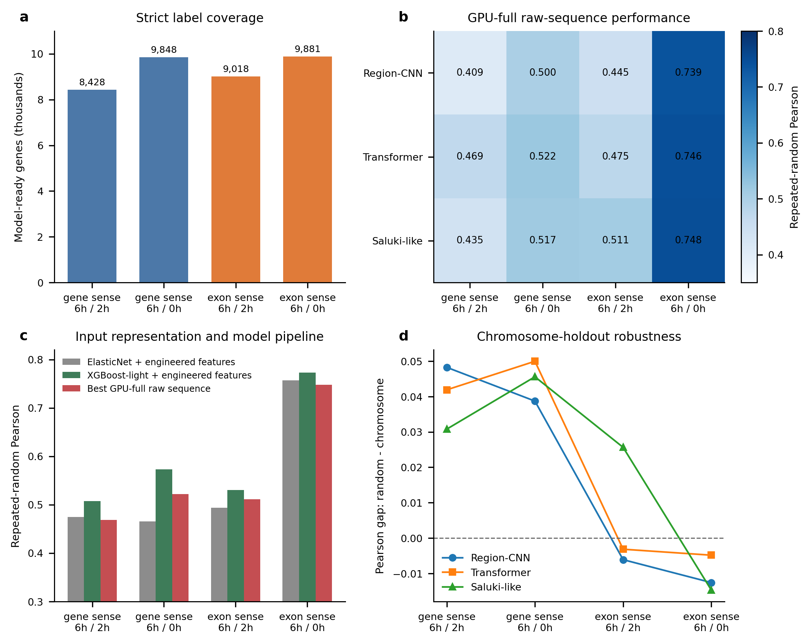
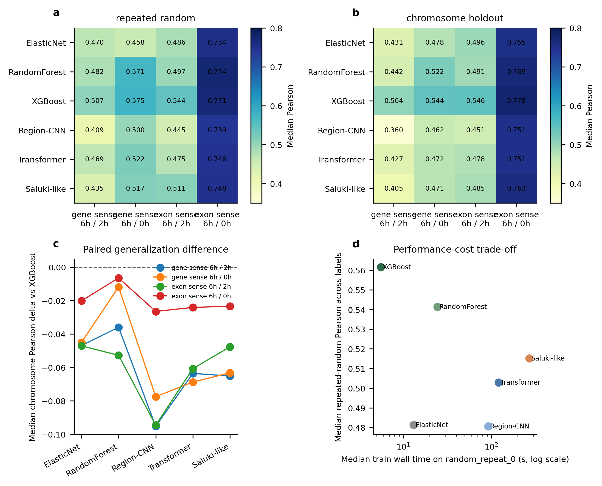

# Current Results and Next Steps

## 项目当前完成度

项目已完成从数据下载、严格标签构建、序列映射、人工特征提取，到四标签六模型固定 split
公平评估的完整闭环。

### 已完成的数据工作

- 下载 96 个 ENCODE gene quantification 文件和 96 个 genic-feature quantification 文件。
- 下载并解析 GENCODE v29 GTF 与转录本序列。
- 建立重复配对、低分母过滤、重复跨度过滤和 pass-only consensus。
- 对 `gene_sense`、`exon_sense` 信号矩阵完成样本 PCA。
- 构建四套严格标签及对应人工特征表、原始序列表。

### 已完成的模型工作

- 人工特征模型：Ridge、ElasticNet、RandomForest、XGBoost-light。
- 原始序列模型：Region-CNN、Conv-tokenized Transformer、Saluki-like CNN-GRU。
- GPU-full 原始序列评估：每个模型和标签包含 3 次 repeated-random 与 23 次
  chromosome-holdout，共 312 次 CUDA 训练。
- 公平 pipeline 比较：建立四套共享 cohort 和显式 split manifest，完成 Full ElasticNet、
  RandomForest、XGBoost 的 312 次拟合，并逐 split 审计复用了全部 312 个深度模型结果。
- 深度输入消融：完成 7 个新条件 × 4 标签 × 3 模型 × 26 splits，共 2,184 次 CUDA 训练；
  与复用 raw-all 结果共同形成 8 条件完整矩阵。
- 深度 hybrid 输入设计：完成 13 个新 Transformer hybrid 配置 × 2 个 6h/2h 代表标签 ×
  26 splits，共 676 次 CUDA 训练；最佳配置复用已审计 hybrid 结果扩展到四标签三模型。

## 核心结果

### 标签质量与覆盖

| 标签 | 严格 consensus 基因 | 模型可用基因 | QC pass fraction |
| --- | ---: | ---: | ---: |
| `gene_sense + 6h/2h` | 8,428 | 8,428 | 0.836 |
| `gene_sense + 6h/0h` | 9,848 | 9,848 | 0.839 |
| `exon_sense + 6h/2h` | 9,765 | 9,018 | 0.849 |
| `exon_sense + 6h/0h` | 10,678 | 9,881 | 0.836 |

### GPU-full 原始序列模型

| 标签 | 最佳模型 | Repeated-random Pearson | Chromosome-holdout Pearson |
| --- | --- | ---: | ---: |
| `gene_sense + 6h/2h` | Transformer | 0.469 | 0.427 |
| `gene_sense + 6h/0h` | Transformer | 0.522 | 0.472 |
| `exon_sense + 6h/2h` | Saluki-like | 0.511 | 0.485 |
| `exon_sense + 6h/0h` | Saluki-like | 0.748 | 0.763 |

### 固定 split 公平模型比较

| 标签 | Repeated-random 最佳模型 / Pearson | Chromosome-holdout 最佳模型 / Pearson |
| --- | --- | --- |
| `gene_sense + 6h/2h` | XGBoost / 0.507 | XGBoost / 0.504 |
| `gene_sense + 6h/0h` | XGBoost / 0.575 | XGBoost / 0.544 |
| `exon_sense + 6h/2h` | XGBoost / 0.544 | XGBoost / 0.546 |
| `exon_sense + 6h/0h` | RandomForest / 0.774 | XGBoost / 0.778 |

### 可支持的结论

1. RNA 稳定性代理标签中存在可泛化的序列信号。
2. 标签定义对性能影响非常明显，超过当前三个深度架构之间的差异。
3. `exon_sense + 6h/0h` 在随机拆分和染色体留出中均表现最好。
4. `6h/0h` 更容易预测，但更可能混入 processing、成熟 RNA retention 和 abundance-linked
   信息；`6h/2h` 更适合保守验证。
5. XGBoost 在全部 chromosome-holdout 与 3/4 repeated-random 任务中领先，并在当前配置下
   同时具有最低的中位训练耗时。
6. 深度模型中去除 CDS 的跨组合平均 chromosome-holdout Pearson 损失为 0.059，
   CDS-only 平均仅损失 0.017，确认 CDS 是主要原始序列信息载体。
7. raw sequence + engineered features hybrid 在 12/12 个模型-标签组合中提升，平均增益
   为 0.037；Transformer hybrid 的跨标签平均 chromosome-holdout Pearson 最高。
8. Transformer hybrid 输入设计筛选选择 `medium_balanced`（256/1024/1024,
   `balanced` crop）作为默认配置；短窗口损失约 0.012 Pearson，长窗口没有稳定增益，
   中等总长度下 3'UTR-heavy 配额下降最明显。

## 当前证据边界

- `log2(6h/0h)` 和 `log2(6h/2h)` 是稳定性代理，不是直接测得的 half-life。
- `gene_sense` 与 `exon_sense` 可能对应不同生物过程，不能只根据预测性能选一个并丢弃另一个。
- XGBoost 使用人工特征，深度模型使用原始序列；公平 benchmark 反映完整 pipeline，而非纯架构。
- CPU quick 深度模型只用于早期流程验证，不应与 GPU-full 结果混为最终排名。
- 当前深度窗口筛选支持中等 balanced 配置；`random` crop 只是固定 seed 的 per-transcript
  裁剪，尚未测试 per-epoch stochastic augmentation。

## 下一步工作

### 已完成：公平模型比较

- 四套 cohort、固定 split manifest、六模型 split-level 指标与配对差异均已保存。
- 完整结果见 [fair_benchmark_report.md](fair_benchmark_report.md)。

### 已完成：人工特征输入消融

- 使用固定 splits 完成 4 标签 × 16 输入集合 × 26 splits，共 1,664 次 Full XGBoost 拟合。
- CDS 是最关键区域；k-mer-only 保留大部分完整模型性能。
- 完整结果见 [input_ablation_report.md](input_ablation_report.md)。

### 已完成：深度输入与区域消融

- 使用固定 splits 完成 raw-all、单区域 only、leave-one-region-out 与 hybrid 对照。
- hybrid 在 12/12 个深度模型-标签组合中提升；CDS 是主要区域。
- 完整结果见 [deep_input_ablation_report.md](deep_input_ablation_report.md)。

### 已完成：深度窗口与裁剪策略消融

- 优先使用综合性能最好的 Transformer hybrid，筛选 gene/exon × `6h/2h` 两个代表标签。
- 系统比较 short/medium/long 窗口、`balanced/start/end/random` 裁剪，以及固定总长度下
  CDS-heavy 和 3'UTR-heavy 配额。
- 最佳配置为 `medium_balanced`，因此四标签三模型扩展复用已完成的 hybrid 结果。
- 完整结果见 [deep_input_design_report.md](deep_input_design_report.md)。

### P0：生物学解释

- 对 XGBoost 做 SHAP、特征组重要性和 motif family 聚类。
- 对 Transformer/Saluki-like 做 attribution 与 in-silico mutagenesis。
- 优先保留跨 `gene_sense/exon_sense`、跨 `6h/2h` 与 `6h/0h` 可重复的候选元件。
- 对候选基因和 motif 做 RBP motif、GO 与 Reactome 富集。

### P1：扩展到 context-aware 模型

- 加入 RBP、miRNA expression 和 eCLIP binding。
- 从 consensus sequence-only 预测扩展到 gene × cell-line stability 预测。

## 关键产物

- `data/processed/parallel_label_quality_summary.tsv`
- `data/processed/parallel_deep_gpu_full_summary.tsv`
- `data/processed/parallel_model_suite_summary.tsv`
- `data/processed/fair_benchmark_summary.tsv`
- `data/processed/fair_benchmark_paired_differences.tsv`
- `data/processed/fair_benchmark_cost_summary.tsv`
- `data/processed/input_ablation_summary.tsv`
- `data/processed/input_ablation_paired_differences.tsv`
- `data/processed/deep_input_ablation_summary.tsv`
- `data/processed/deep_input_ablation_paired_differences.tsv`
- `data/processed/deep_input_design_summary.tsv`
- `data/processed/deep_input_design_paired_differences.tsv`
- `data/processed/deep_input_design_screen_ranking.tsv`
- `data/processed/figure_source_data/`
- `docs/figures/current_results_overview.{png,svg,pdf}`
- `docs/figures/gpu_full_model_comparison.{png,svg,pdf}`
- `docs/figures/fair_benchmark_overview.{png,svg,pdf}`
- `docs/figures/input_ablation_overview.{png,svg,pdf}`
- `docs/figures/deep_input_ablation_chromosome_holdout.{png,svg,pdf}`
- `docs/figures/deep_input_ablation_paired_differences.{png,svg,pdf}`
- `docs/figures/deep_input_design_screen_ranking.{png,svg,pdf}`
- `docs/figures/deep_input_design_screen_paired_differences.{png,svg,pdf}`
