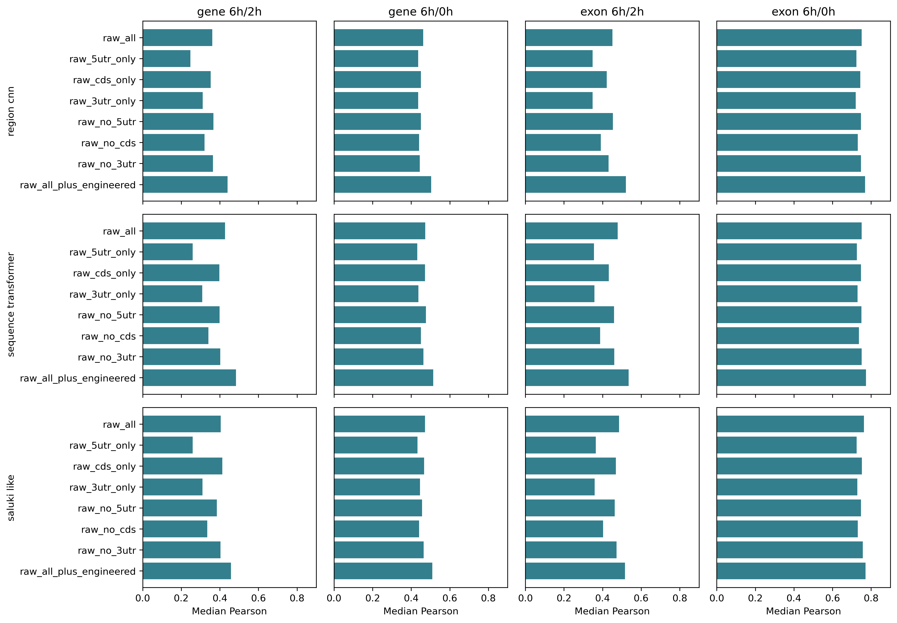
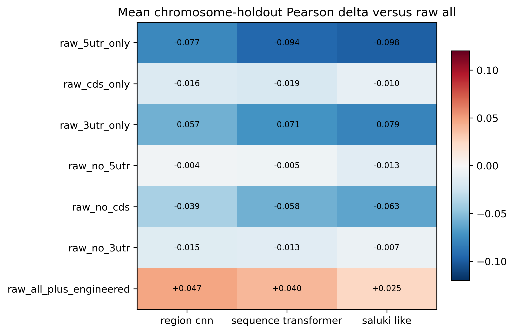

# Deep Raw-Sequence Region Ablation and Hybrid Benchmark

All conditions use the fixed fair-benchmark splits and unchanged model architectures.
The benchmark contains 2,184 new GPU trainings plus 312 reused raw-all trainings.

## Main Findings

- Hybrid input improves all 12/12 model-label combinations, with a mean paired chromosome-holdout Pearson gain of +0.037.
- Removing CDS has the largest leave-one-region-out penalty (-0.053), while CDS-only retains most raw-all performance (-0.015).
- Removing 5'UTR has a smaller average effect (-0.007) than removing 3'UTR (-0.012).

## Cross-Architecture Condition Effects

| Condition | Mean paired delta | Min to max delta | Mean split win fraction | Positive combinations |
| --- | ---: | ---: | ---: | ---: |
| `raw_5utr_only` | -0.090 | -0.156 to -0.029 | 0.03 | 0/12 |
| `raw_cds_only` | -0.015 | -0.036 to -0.001 | 0.28 | 0/12 |
| `raw_3utr_only` | -0.069 | -0.149 to -0.023 | 0.04 | 0/12 |
| `raw_no_5utr` | -0.007 | -0.035 to +0.003 | 0.40 | 3/12 |
| `raw_no_cds` | -0.053 | -0.110 to -0.013 | 0.07 | 0/12 |
| `raw_no_3utr` | -0.012 | -0.035 to +0.005 | 0.32 | 2/12 |
| `raw_all_plus_engineered` | +0.037 | +0.016 to +0.068 | 0.88 | 12/12 |

## Hybrid Effect by Model and Label

| Label | Model | Raw-all median Pearson | Hybrid median Pearson | Mean paired delta |
| --- | --- | ---: | ---: | ---: |
| `gene_sense_late_chase_6h_2h` | `region_cnn` | 0.360 | 0.440 | +0.068 |
| `gene_sense_late_chase_6h_2h` | `sequence_transformer` | 0.427 | 0.484 | +0.047 |
| `gene_sense_late_chase_6h_2h` | `saluki_like` | 0.405 | 0.458 | +0.040 |
| `gene_sense_total_chase_6h_0h` | `region_cnn` | 0.462 | 0.503 | +0.037 |
| `gene_sense_total_chase_6h_0h` | `sequence_transformer` | 0.472 | 0.514 | +0.036 |
| `gene_sense_total_chase_6h_0h` | `saluki_like` | 0.471 | 0.510 | +0.028 |
| `exon_sense_late_chase_6h_2h` | `region_cnn` | 0.451 | 0.521 | +0.062 |
| `exon_sense_late_chase_6h_2h` | `sequence_transformer` | 0.478 | 0.535 | +0.058 |
| `exon_sense_late_chase_6h_2h` | `saluki_like` | 0.485 | 0.516 | +0.017 |
| `exon_sense_total_chase_6h_0h` | `region_cnn` | 0.751 | 0.769 | +0.022 |
| `exon_sense_total_chase_6h_0h` | `sequence_transformer` | 0.751 | 0.774 | +0.018 |
| `exon_sense_total_chase_6h_0h` | `saluki_like` | 0.763 | 0.771 | +0.016 |

## Design

- Removed regions are replaced with empty sequences while original model windows and architecture remain unchanged.
- Existing raw-all GPU-full results are reused; every new split is audited against the fixed manifest.
- Hybrid conditions add all 1,336 engineered sequence features, fitted and standardized using training genes only.
- Summary bars use the median across splits; paired deltas use split-matched mean differences versus raw-all.
- Per-model-label paired tables include bootstrap 95% confidence intervals and win fractions.

## Outputs

- `data/processed/deep_input_ablation_summary.tsv`
- `data/processed/deep_input_ablation_paired_differences.tsv`
- `docs/figures/deep_input_ablation_chromosome_holdout.{png,svg,pdf}`
- `docs/figures/deep_input_ablation_paired_differences.{png,svg,pdf}`
