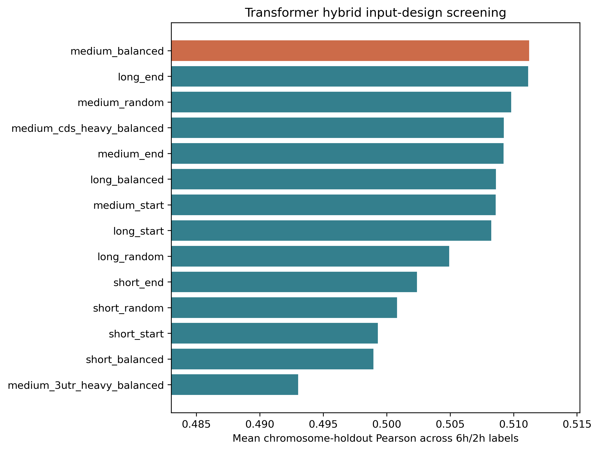
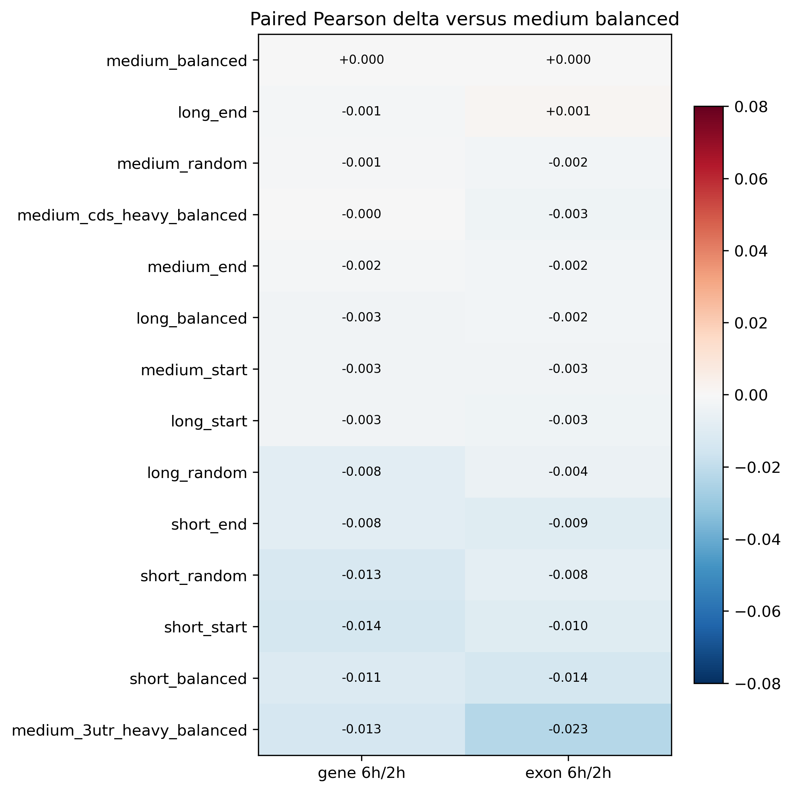

# Deep Hybrid Input-Design Benchmark

The screening stage compares Transformer hybrid window budgets, crop strategies, and fixed-budget region allocations on the gene/exon 6h/2h labels.

Selected configuration: `medium_balanced`.

## Main Findings

- `medium_balanced` remains the most robust default: 5'UTR/CDS/3'UTR = 256/1024/1024 with `balanced` crop.
- Short balanced windows lose -0.012 mean paired Pearson versus the selected medium balanced reference.
- Long balanced windows do not improve the average result (-0.003); `long_end` is close to the reference (-0.000) but does not clearly surpass it.
- At the same total medium budget, CDS-heavy allocation is only slightly lower (-0.002), whereas 3'UTR-heavy allocation is much worse (-0.018).
- These results support keeping a medium, region-balanced hybrid input while moving biological interpretation toward CDS-aware sequence features rather than simply making the transcript window longer.

## Screening Ranking

| Rank | Configuration | Mean Pearson | Worst-label delta | Mean paired delta | Win fraction |
| ---: | --- | ---: | ---: | ---: | ---: |
| 1 | `medium_balanced` | 0.511 | +0.000 | +0.000 | reference |
| 2 | `long_end` | 0.511 | -0.001 | -0.000 | 0.46 |
| 3 | `medium_random` | 0.510 | -0.002 | -0.001 | 0.48 |
| 4 | `medium_cds_heavy_balanced` | 0.509 | -0.003 | -0.002 | 0.50 |
| 5 | `medium_end` | 0.509 | -0.002 | -0.002 | 0.46 |
| 6 | `long_balanced` | 0.509 | -0.003 | -0.003 | 0.52 |
| 7 | `medium_start` | 0.509 | -0.003 | -0.003 | 0.39 |
| 8 | `long_start` | 0.508 | -0.003 | -0.003 | 0.50 |
| 9 | `long_random` | 0.505 | -0.008 | -0.006 | 0.43 |
| 10 | `short_end` | 0.502 | -0.009 | -0.009 | 0.37 |
| 11 | `short_random` | 0.501 | -0.013 | -0.010 | 0.35 |
| 12 | `short_start` | 0.499 | -0.014 | -0.012 | 0.33 |
| 13 | `short_balanced` | 0.499 | -0.014 | -0.012 | 0.30 |
| 14 | `medium_3utr_heavy_balanced` | 0.493 | -0.023 | -0.018 | 0.17 |

## Expansion Status

- Four-label, three-model expansion complete: `True`.
- The selected `medium_balanced` configuration is the previously completed raw sequence + engineered feature hybrid setting, so the expansion reuses the already audited four-label, three-model results.
- Selection prioritizes mean chromosome-holdout Pearson across both 6h/2h labels; worst-label paired delta is used as the consistency tie-breaker.
- `random` is a deterministic per-transcript crop generated once with the fixed experiment seed, not per-epoch stochastic augmentation.
