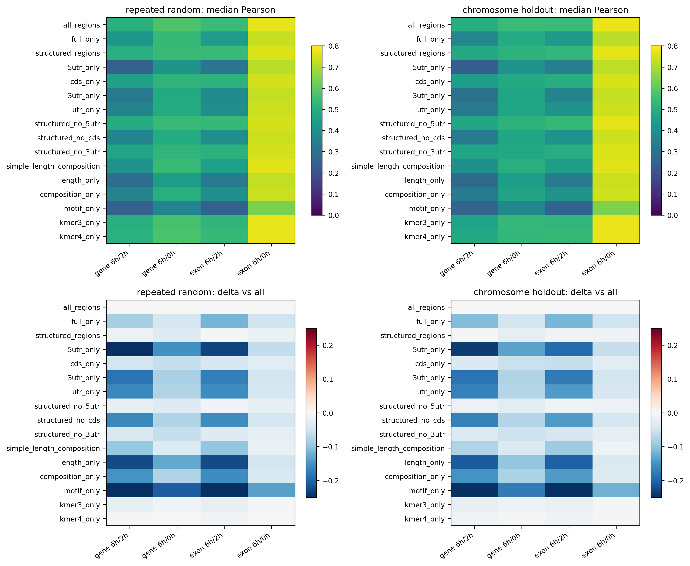

# Engineered-Feature Input Ablation

Full XGBoost was evaluated on the fixed fair-benchmark manifests using 16 interpretable input feature sets.

## Best Reduced Input by Label

| Label | Best reduced set | Median Pearson | Delta versus all regions |
| --- | --- | ---: | ---: |
| `gene_sense_late_chase_6h_2h` | `structured_regions` | 0.487 | -0.006 |
| `gene_sense_total_chase_6h_0h` | `kmer3_only` | 0.533 | -0.012 |
| `exon_sense_late_chase_6h_2h` | `kmer4_only` | 0.534 | -0.012 |
| `exon_sense_total_chase_6h_0h` | `kmer4_only` | 0.776 | -0.003 |

## Main Conclusions

1. CDS is the dominant individual region for all four labels; removing CDS from the structured representation causes the largest region-level performance loss.
2. Explicit 5'UTR/CDS/3'UTR features outperform full-transcript-only features, showing that region identity carries useful information.
3. Removing 5'UTR has only a small effect, whereas removing 3'UTR causes a moderate loss and removing CDS causes a large loss.
4. K-mer-only inputs retain most of the full model performance; motif-only inputs are insufficient in the current motif panel.
5. For exon_sense 6h/0h, 16 length/composition variables remain highly predictive, supporting the concern that this label contains strong abundance- or processing-linked sequence correlates.

## Design Notes

- All runs use the same train, validation, and test assignments as the fair benchmark.
- Region leave-one-out sets exclude `full` features, preventing indirect leakage of the removed region.
- This phase isolates engineered-feature information content using the strongest fair-benchmark model.
- Deep raw-sequence region ablation and sequence-plus-tabular hybrid experiments remain a separate GPU phase.

## Outputs

- `data/processed/input_ablation_summary.tsv`
- `data/processed/input_ablation_paired_differences.tsv`
- `docs/figures/input_ablation_overview.{png,svg,pdf}`
- `docs/figures/input_ablation_chromosome_holdout.{png,svg,pdf}`
