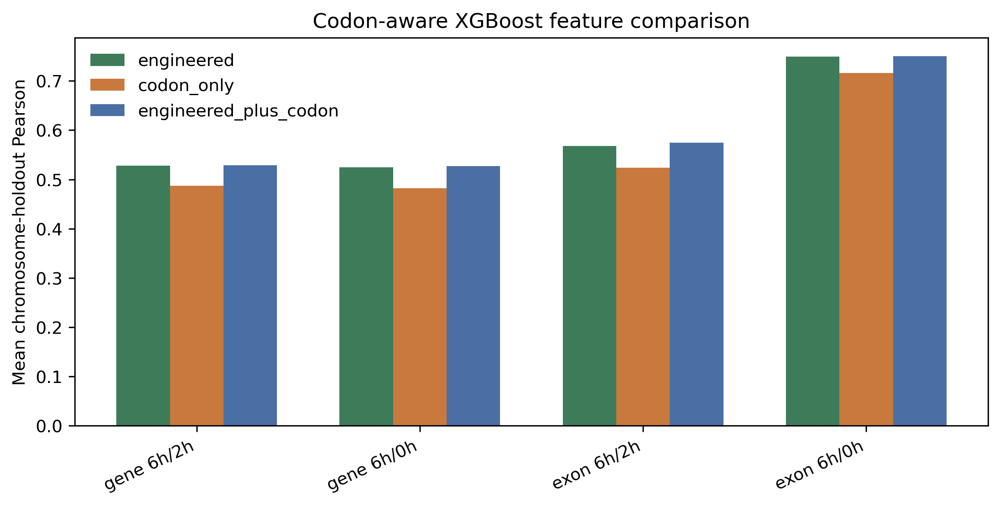
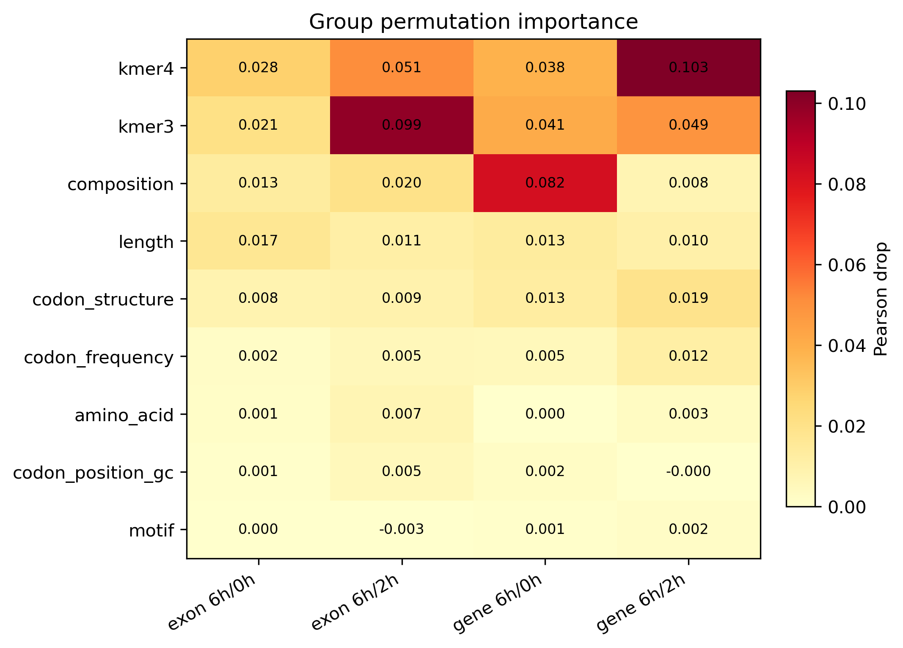
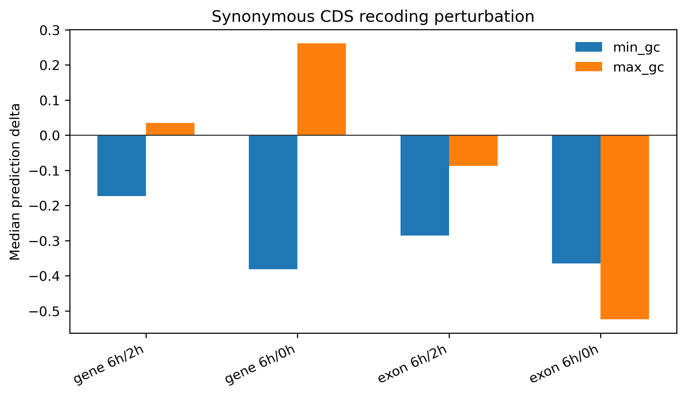

# Mechanistic Interpretation: Codons, Permutation Importance, and In-Silico Recoding

This report extends the biological interpretation with codon-aware features, group-level XGBoost permutation importance, and synonymous CDS recoding perturbations.

The default run is a representative fixed-split mechanism screen: `random_repeat_0` plus six chromosome-holdout splits (`chr1`, `chr7`, `chr14`, `chr19`, `chr22`, `chrX`). It is intended for interpretation, not as a replacement for the full fair benchmark.

## Main Findings

- Adding codon-aware features gives the largest mean chromosome-holdout Pearson change for `exon_sense_late_chase_6h_2h` (+0.007).
- The strongest average permutation group is `kmer4` (mean Pearson drop 0.055), followed by `kmer3` (0.052).
- Synonymous CDS GC-min recoding changes predictions by a median of -0.302; GC-max recoding changes predictions by -0.079. These are feature-model perturbations, not direct deep-model attribution.
- SHAP was not run because the current environment does not provide the `shap` package; permutation importance is the primary model-agnostic importance estimate here.
- Existing GPU-full deep runs did not save checkpoints, so true Transformer/Saluki position-level in-silico mutagenesis requires a checkpoint-saving re-run.

## Codon-Aware Feature Performance

| Label | Engineered | Codon-only | Engineered + codon | Codon gain |
| --- | ---: | ---: | ---: | ---: |
| gene 6h/2h | 0.528 | 0.487 | 0.529 | +0.002 |
| gene 6h/0h | 0.524 | 0.482 | 0.527 | +0.003 |
| exon 6h/2h | 0.568 | 0.524 | 0.575 | +0.007 |
| exon 6h/0h | 0.749 | 0.716 | 0.750 | +0.001 |

## Group Permutation Importance

| Rank | Feature group | Mean Pearson drop |
| ---: | --- | ---: |
| 1 | `kmer4` | 0.055 |
| 2 | `kmer3` | 0.052 |
| 3 | `composition` | 0.031 |
| 4 | `length` | 0.013 |
| 5 | `codon_structure` | 0.012 |
| 6 | `codon_frequency` | 0.006 |
| 7 | `amino_acid` | 0.003 |
| 8 | `codon_position_gc` | 0.002 |
| 9 | `motif` | -0.000 |

## Synonymous CDS Recoding

| Label | GC-min median delta | GC-max median delta |
| --- | ---: | ---: |
| gene 6h/2h | -0.173 | +0.035 |
| gene 6h/0h | -0.382 | +0.261 |
| exon 6h/2h | -0.286 | -0.088 |
| exon 6h/0h | -0.365 | -0.524 |

GC-min and GC-max recoding preserve amino-acid sequence but deliberately change synonymous codon choices. Large prediction shifts therefore support a codon-usage-sensitive CDS signal, while still remaining model-based perturbations.

## Outputs

- `data/processed/mechanistic_codon_augmented_features_<label>.tsv`
- `data/processed/mechanistic_codon_xgboost_metrics.tsv`
- `data/processed/mechanistic_codon_xgboost_summary.tsv`
- `data/processed/mechanistic_permutation_importance.tsv`
- `data/processed/mechanistic_synonymous_mutagenesis.tsv`
- `data/processed/mechanistic_synonymous_mutagenesis_summary.tsv`
- `docs/figures/mechanistic_codon_feature_performance.{png,svg,pdf}`
- `docs/figures/mechanistic_permutation_importance.{png,svg,pdf}`
- `docs/figures/mechanistic_synonymous_mutagenesis.{png,svg,pdf}`
