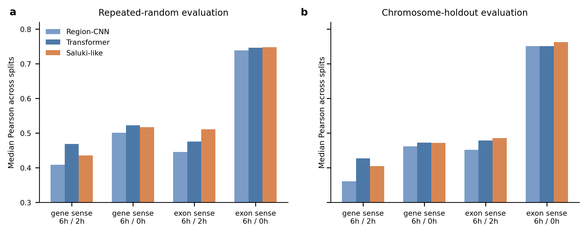

# Parallel Label Model Suite Benchmark

当前阶段总览见 [current_results.md](current_results.md)。

This benchmark applies the four strict labels to additional project models.

## Labels

- `gene_sense_late_chase_6h_2h`
- `gene_sense_total_chase_6h_0h`
- `exon_sense_late_chase_6h_2h`
- `exon_sense_total_chase_6h_0h`

## Models Tested

Full benchmark:

- `elasticnet_full`: full repeated-random plus full chromosome holdout.

Quick compact benchmark:

- `ridge`
- `random_forest_light`
- `xgboost_light`

Quick deep CPU benchmark:

- `region_cnn_quick_cpu`
- `sequence_transformer_quick_cpu`
- `saluki_like_quick_cpu`

Full deep GPU benchmark:

- `region_cnn_gpu_full`
- `sequence_transformer_gpu_full`
- `saluki_like_gpu_full`

The GPU-full benchmark uses raw sequence only, default full sequence lengths and model dimensions, early stopping, three repeated-random splits, and 23 chromosome-holdout splits. All 312 split-level training runs completed on CUDA without errors.

## Main Outputs

- `data/processed/parallel_model_suite_summary.tsv`
- `data/processed/parallel_compact_model_benchmark_summary.tsv`
- `data/processed/parallel_deep_gpu_full_summary.tsv`
- `docs/figures/parallel_model_suite_repeated_random.png`

## Repeated-Random Pearson Highlights

| label | best GPU-full raw-sequence model | Pearson |
| --- | --- | ---: |
| gene_sense_late_chase_6h_2h | sequence_transformer_gpu_full | 0.469 |
| gene_sense_total_chase_6h_0h | sequence_transformer_gpu_full | 0.522 |
| exon_sense_late_chase_6h_2h | saluki_like_gpu_full | 0.511 |
| exon_sense_total_chase_6h_0h | saluki_like_gpu_full | 0.748 |

`exon_sense_total_chase_6h_0h` remains the easiest endpoint across almost every model family.

## Interpretation

1. Tree-based compact models remain very competitive. `xgboost_light` exceeds every GPU-full raw-sequence model on all four repeated-random label settings.
2. Among GPU-full raw-sequence models, the Transformer performs best on both gene-sense labels, while Saluki-like performs best on both exon-sense labels.
3. Ridge underperforms, especially in chromosome holdout, suggesting the signal is nonlinear or requires feature interactions.
4. For late-chase labels, engineered k-mer/motif/composition features remain the strongest first-line interpretation backbone.
5. Longer default sequence windows did not consistently outperform the short-window CPU probes. Sequence crop length and region allocation should be tuned rather than assumed to improve with length.

Recommended next controlled experiments:

- Full XGBoost on all four labels using the same repeated-random and chromosome splits.
- Raw-sequence length and crop-strategy ablations.
- Hybrid deep models combining raw sequence with engineered features.
