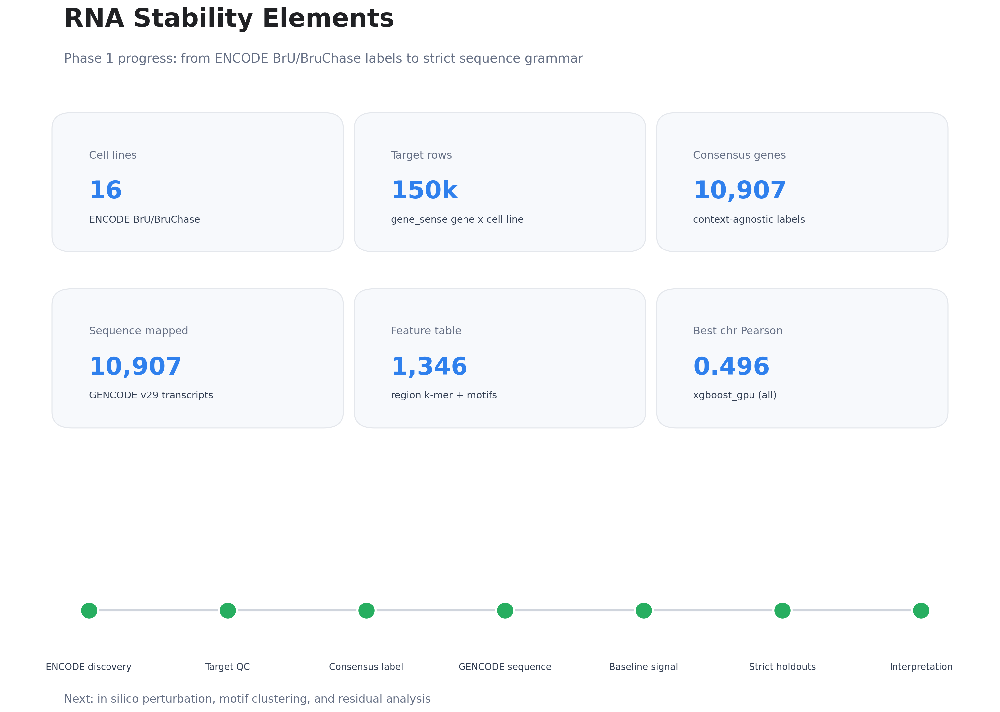
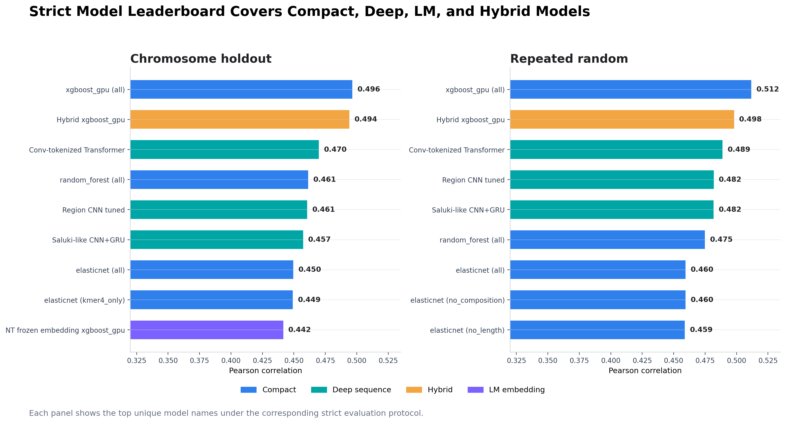
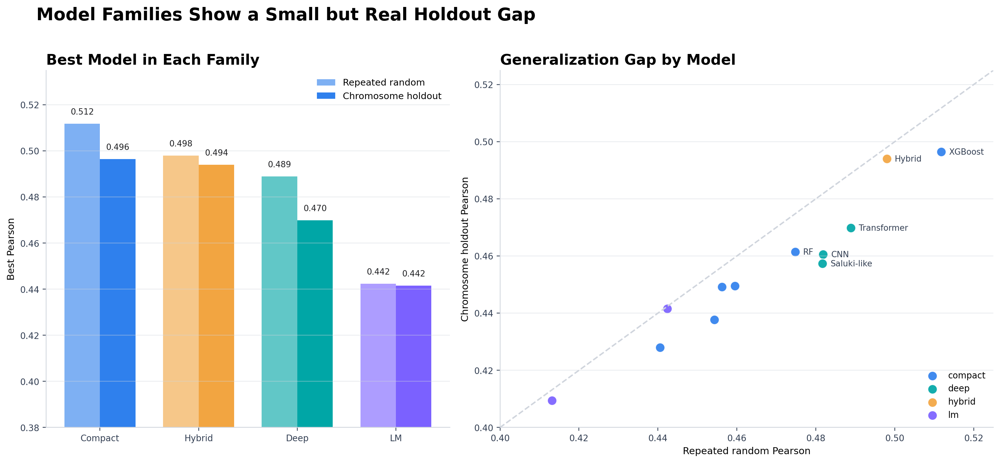
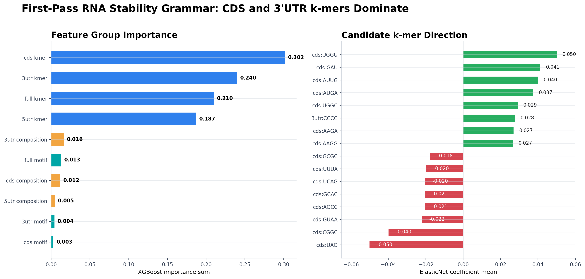
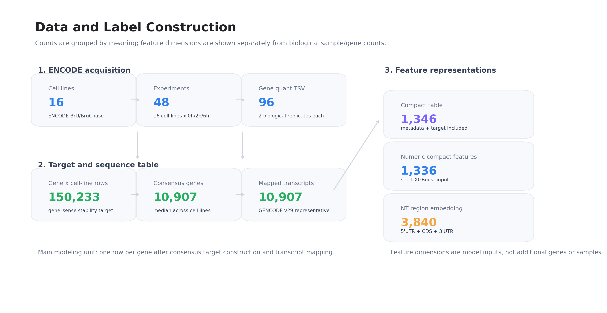
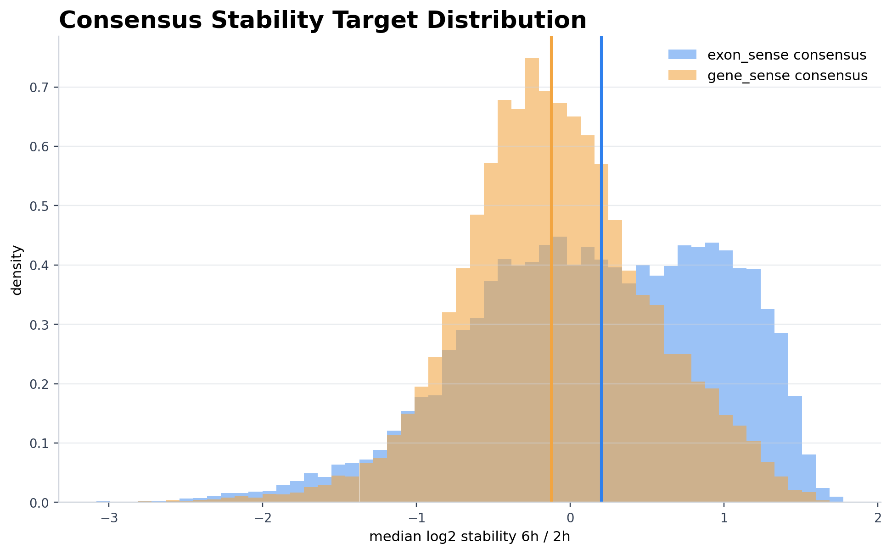
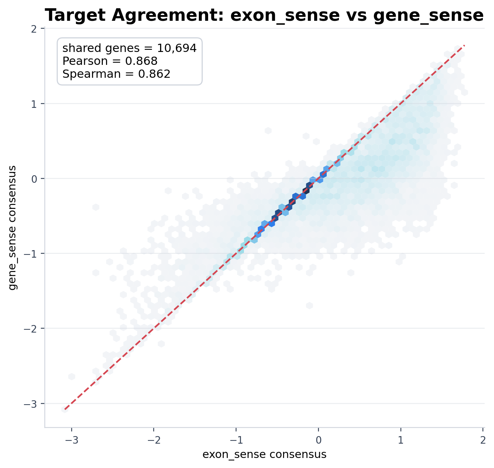
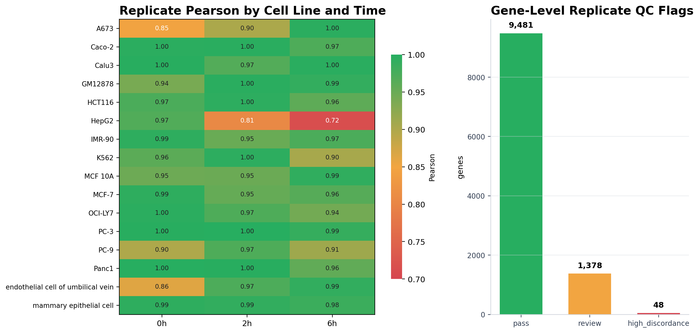
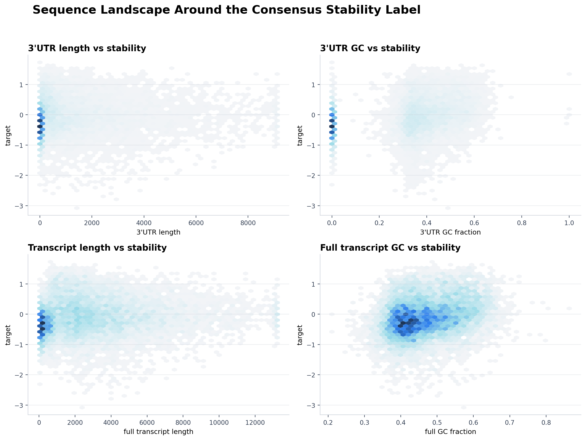

# RNA Stability Elements: 历史单标签可视化进展报告

> **历史报告。** 本文档记录早期 `gene_sense + log2(6h/2h)` 单标签阶段，不代表当前四标签
> 或 GPU-full 最终结论。当前入口请阅读 [current_results.md](current_results.md)。

## 当前做到哪里了

项目已经完成第一阶段的主要闭环：ENCODE BrU/BruChase-seq 数据整理、gene-level stability target、replicate QC、GENCODE v29 representative transcript 序列接入、compact sequence features、严格评估、统一模型 leaderboard，以及第一版 RNA stability grammar interpretation。

- 建模基因数: 10,907
- GENCODE v29 sequence mapped genes: 10,907
- 该历史阶段主标签: `gene_sense` consensus median of `log2_stability_6h_2h`
- 当前最佳严格模型: xgboost_gpu (all)，repeated random Pearson = 0.512，chromosome holdout Pearson = 0.496
- 最新模型和语法解释: `docs/rna_stability_grammar_interpretation_report.md`

## 图 1. 阶段一进度总览

## 图 2. 全模型 Leaderboard

## 图 3. 模型家族与泛化

## 图 4. 第一版 RNA Stability Grammar

## 图 5. 数据与标签构建

## 图 6. Target 分布与标签一致性

## 图 7. Replicate QC 与序列 landscape

## 目前结论

1. `gene_sense` 与 `exon_sense` target 在 gene x cell_line 和 consensus 层面均高度一致，说明标签不是单一 quantification 定义偶然造成的。
2. 10,907 个 consensus genes 已全部映射到 GENCODE v29 representative transcript，序列侧建模链路已经打通。
3. 严格评估显示 compact k-mer / motif / composition XGBoost-GPU 是当前最强模型，chromosome holdout Pearson 约 0.496。
4. Conv-tokenized Transformer 是当前最好的 deep sequence model，chromosome holdout Pearson 约 0.470；pretrained Nucleotide Transformer embedding 与 compact features 融合后接近但没有超过 compact XGBoost。
5. 第一版解释结果支持 CDS 和 3'UTR k-mer grammar 是当前最主要的可预测信号。下一步应优先做 in silico perturbation、motif clustering 和 residual analysis，而不是单纯继续堆模型。
