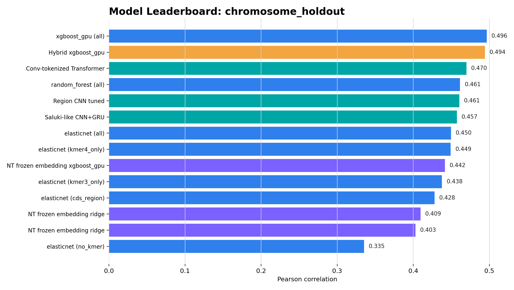
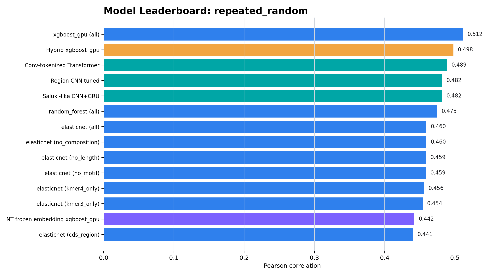
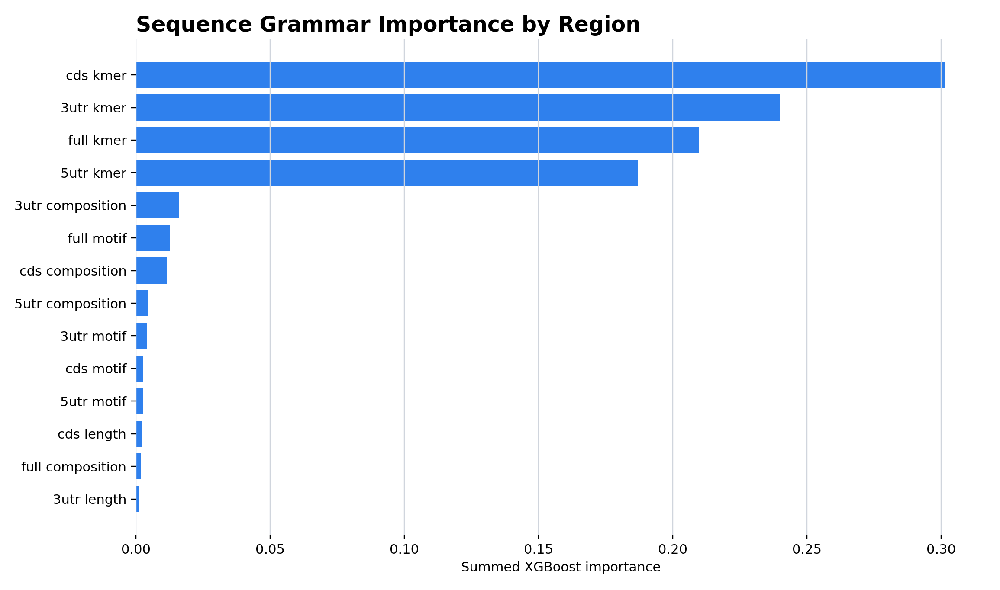
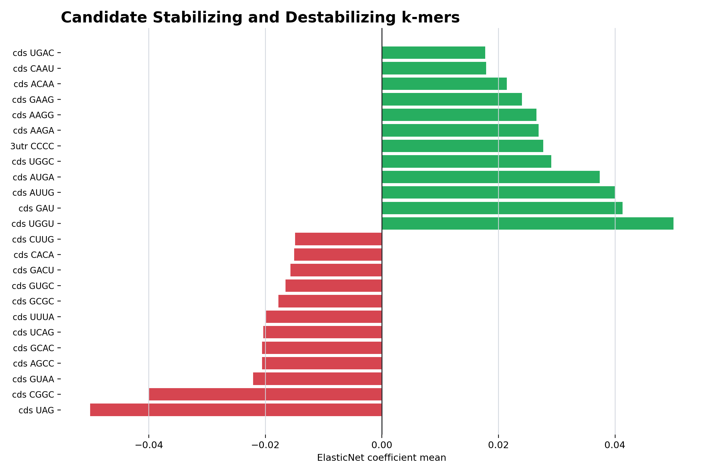

# RNA Stability Grammar Interpretation Report

> **历史报告。** 本文档保存早期单标签 sequence grammar 探索。当前四标签结果与证据边界请
> 以 [current_results.md](current_results.md) 为准。

## 1. 统一模型 Leaderboard

### Chromosome Holdout Top Models

| display_model | model_family | pearson_mean | spearman_mean | r2_mean | rmse_mean |
| --- | --- | --- | --- | --- | --- |
| xgboost_gpu (all) | compact | 0.496 | 0.499 | 0.238 | 0.518 |
| Hybrid xgboost_gpu | hybrid | 0.494 | 0.498 | 0.236 | 0.518 |
| Conv-tokenized Transformer | deep | 0.470 | 0.472 | 0.205 | 0.528 |
| random_forest (all) | compact | 0.461 | 0.479 | 0.195 | 0.532 |
| Region CNN tuned | deep | 0.461 | 0.465 | 0.198 | 0.531 |
| Saluki-like CNN+GRU | deep | 0.457 | 0.455 | 0.193 | 0.532 |
| elasticnet (all) | compact | 0.450 | 0.463 | 0.192 | 0.533 |
| elasticnet (kmer4_only) | compact | 0.449 | 0.463 | 0.192 | 0.533 |

### Repeated Random Top Models

| display_model | model_family | pearson_mean | spearman_mean | r2_mean | rmse_mean |
| --- | --- | --- | --- | --- | --- |
| xgboost_gpu (all) | compact | 0.512 | 0.508 | 0.261 | 0.523 |
| Hybrid xgboost_gpu | hybrid | 0.498 | 0.502 | 0.247 | 0.532 |
| Conv-tokenized Transformer | deep | 0.489 | 0.491 | 0.222 | 0.537 |
| Region CNN tuned | deep | 0.482 | 0.483 | 0.222 | 0.537 |
| Saluki-like CNN+GRU | deep | 0.482 | 0.482 | 0.226 | 0.535 |
| random_forest (all) | compact | 0.475 | 0.488 | 0.216 | 0.538 |
| elasticnet (all) | compact | 0.460 | 0.475 | 0.209 | 0.541 |
| elasticnet (no_composition) | compact | 0.460 | 0.475 | 0.209 | 0.541 |

## 2. 当前模型结论

- 当前总体最强仍是 compact k-mer/motif/composition XGBoost，chromosome holdout Pearson 约 0.496。
- Hybrid XGBoost 将 Nucleotide Transformer embedding 与 compact features 融合后，chromosome holdout Pearson 约 0.494，接近但没有超过 compact XGBoost。
- 当前最佳深度序列模型是 Conv-tokenized Transformer，chromosome holdout Pearson 约 0.470。
- LM-only XGBoost 约 0.442，说明 pretrained embedding 有信号，但不足以替代显式 k-mer grammar。

## 3. 第一版通用 RNA Stability Grammar

### Feature Group Importance

| region | grammar_type | xgb_importance_sum | coef_abs_sum | n_features |
| --- | --- | --- | --- | --- |
| cds | kmer | 0.302 | 1.076 | 320 |
| 3utr | kmer | 0.240 | 0.370 | 320 |
| full | kmer | 0.210 | 0.273 | 320 |
| 5utr | kmer | 0.187 | 0.242 | 320 |
| 3utr | composition | 0.016 | 0.000 | 3 |
| full | motif | 0.013 | 0.001 | 10 |
| cds | composition | 0.012 | 0.000 | 3 |
| 5utr | composition | 0.005 | 0.000 | 3 |
| 3utr | motif | 0.004 | 0.021 | 10 |
| cds | motif | 0.003 | 0.005 | 10 |
| 5utr | motif | 0.003 | 0.012 | 10 |
| cds | length | 0.002 | 0.000 | 1 |

### XGBoost Top Sequence Features

| feature | region | grammar_type | grammar_token | xgb_importance | coef_mean |
| --- | --- | --- | --- | --- | --- |
| cds_kmer_GGC | cds | kmer | GGC | 0.023 | 0.000 |
| 3utr_gc_fraction | 3utr | composition | GC_fraction | 0.014 | 0.000 |
| cds_kmer_GCG | cds | kmer | GCG | 0.011 | 0.000 |
| full_motif_AU-rich_count | full | motif | AU-rich | 0.009 | 0.000 |
| 3utr_kmer_CCU | 3utr | kmer | CCU | 0.009 | 0.017 |
| cds_gc_fraction | cds | composition | GC_fraction | 0.009 | 0.000 |
| 3utr_kmer_CCC | 3utr | kmer | CCC | 0.006 | 0.000 |
| 3utr_kmer_CUG | 3utr | kmer | CUG | 0.004 | 0.002 |
| cds_kmer_GCUG | cds | kmer | GCUG | 0.004 | 0.008 |
| cds_kmer_UGG | cds | kmer | UGG | 0.004 | 0.000 |
| 3utr_kmer_CCCU | 3utr | kmer | CCCU | 0.003 | 0.017 |
| 3utr_kmer_GCC | 3utr | kmer | GCC | 0.003 | 0.000 |
| full_kmer_CGCC | full | kmer | CGCC | 0.003 | 0.007 |
| full_kmer_GCCG | full | kmer | GCCG | 0.003 | 0.000 |
| cds_kmer_GAUG | cds | kmer | GAUG | 0.003 | 0.015 |

### Candidate Stabilizing k-mers

| feature | region | grammar_token | coef_mean | xgb_importance |
| --- | --- | --- | --- | --- |
| cds_kmer_UGGU | cds | UGGU | 0.050 | 0.002 |
| cds_kmer_GAU | cds | GAU | 0.041 | 0.003 |
| cds_kmer_AUUG | cds | AUUG | 0.040 | 0.001 |
| cds_kmer_AUGA | cds | AUGA | 0.037 | 0.001 |
| cds_kmer_UGGC | cds | UGGC | 0.029 | 0.002 |
| 3utr_kmer_CCCC | 3utr | CCCC | 0.028 | 0.002 |
| cds_kmer_AAGA | cds | AAGA | 0.027 | 0.001 |
| cds_kmer_AAGG | cds | AAGG | 0.027 | 0.002 |
| cds_kmer_GAAG | cds | GAAG | 0.024 | 0.002 |
| cds_kmer_ACAA | cds | ACAA | 0.021 | 0.001 |
| cds_kmer_CAAU | cds | CAAU | 0.018 | 0.001 |
| cds_kmer_UGAC | cds | UGAC | 0.018 | 0.001 |

### Candidate Destabilizing k-mers

| feature | region | grammar_token | coef_mean | xgb_importance |
| --- | --- | --- | --- | --- |
| cds_kmer_UAG | cds | UAG | -0.050 | 0.002 |
| cds_kmer_CGGC | cds | CGGC | -0.040 | 0.002 |
| cds_kmer_GUAA | cds | GUAA | -0.022 | 0.001 |
| cds_kmer_AGCC | cds | AGCC | -0.021 | 0.001 |
| cds_kmer_GCAC | cds | GCAC | -0.021 | 0.001 |
| cds_kmer_UCAG | cds | UCAG | -0.020 | 0.001 |
| cds_kmer_UUUA | cds | UUUA | -0.020 | 0.001 |
| cds_kmer_GCGC | cds | GCGC | -0.018 | 0.001 |
| cds_kmer_GUGC | cds | GUGC | -0.017 | 0.001 |
| cds_kmer_GACU | cds | GACU | -0.016 | 0.001 |
| cds_kmer_CACA | cds | CACA | -0.015 | 0.001 |
| cds_kmer_CUUG | cds | CUUG | -0.015 | 0.001 |

## 4. Biological Reading

RNA stability 的可预测信号主要来自局部序列语法，尤其是 CDS 和 3'UTR 的 k-mer / composition。5'UTR 也有信号，但贡献较弱。Nucleotide Transformer embedding 中 CDS 区域贡献最大，与 compact feature 的 CDS / 3'UTR k-mer 重要性互相印证。

下一步应把 top k-mer 聚类为 motif grammar，并结合 in silico mutagenesis / saliency 在 deep sequence model 上验证这些候选语法是否真的改变预测稳定性。
